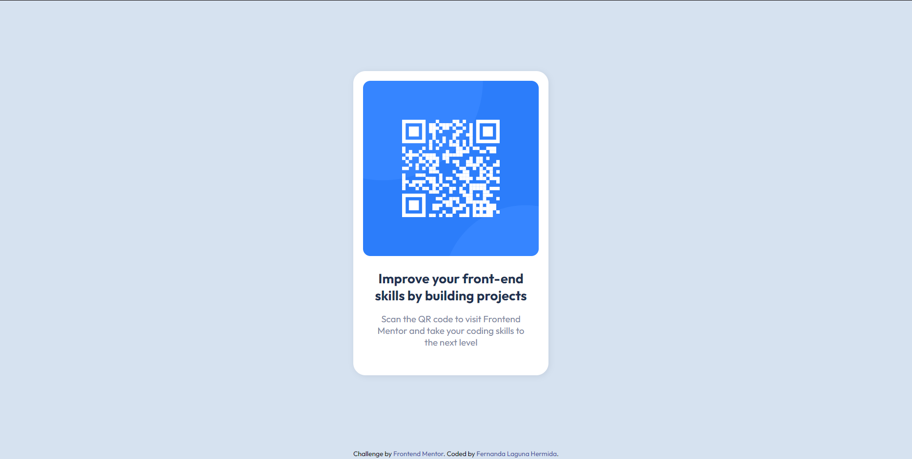

# Frontend Mentor - QR code component solution

This is a solution to the [QR code component challenge on Frontend Mentor](https://www.frontendmentor.io/challenges/qr-code-component-iux_sIO_H). Frontend Mentor challenges help you improve your coding skills by building realistic projects. 

## Table of contents

- [Overview](#overview)
  - [Screenshot](#screenshot)
  - [Links](#links)
- [My process](#my-process)
  - [Built with](#built-with)
  - [What I learned](#what-i-learned)
  - [Continued development](#continued-development)
  - [Useful resources](#useful-resources)
- [Author](#author)

**Note: Delete this note and update the table of contents based on what sections you keep.**

## Overview

This is my first solution to the Frontend Mentor challenges. It's a basic card component with a top image, a heading and a paragraph, builded only with HTML5 and CSS3.

### Screenshot

### Links

- Solution URL: [https://www.frontendmentor.io/solutions/card-component-using-flexbox-NiyOkY83l5](https://www.frontendmentor.io/solutions/card-component-using-flexbox-NiyOkY83l5)
- Live Site URL: [https://ferlagher.github.io/FMC-QR-code-component/](https://ferlagher.github.io/FMC-QR-code-component)

## My process

First, I created the structure in HTML. Then declarated the variables for colors, fonts and sizes. I't wasn't really necesary beacause it was a small challenge, but I wanted to buid it like it was a real project. I gived the body a `display:grid` to keep the footer in place and align the content. Then just aplied the styles.

I also used Photoshop to take some mesurements.

### Built with

- Semantic HTML5 markup
- CSS custom properties
- Flexbox
- CSS Grid

### What I learned

Building the component wasn't hard. The **real challenge** was writing this README. I need to improve my english, and my redaction skills.

This little project was good for practising Git and getting more confident using the terminal.

### Continued development

I will continue with this challenges, they are great for practising and learning. Nex one will be [this one](https://www.frontendmentor.io/challenges/product-preview-card-component-GO7UmttRfa). I'm also learning Javascript, but I want to start with the easy ones first.

### Useful resources

- [W3Schools](https://www.w3schools.com)
- [Git documentation](https://git-scm.com/docs)
- [Markdown tutorial](https://www.markdowntutorial.com)

## Author

- LinkedIn - [ferlagher](https://www.linkedin.com/in/ferlagher/)
- Frontend Mentor - [@ferlagher](https://www.frontendmentor.io/profile/ferlagher)
- Instagram - [@ferlagher](https://www.instagram.com/ferlagher/)

Thank you very much for reading. ♥
